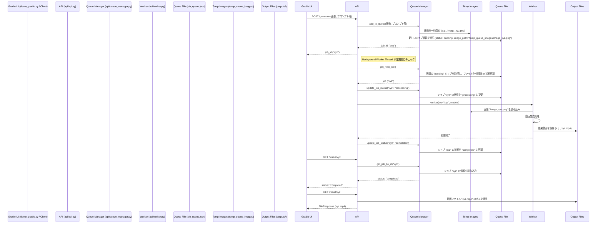

# FramePack キューシステム解説

このドキュメントでは、FramePackプロジェクトにおける動画生成ジョブのキューシステムの仕組みについて説明します。このシステムは、時間のかかる動画生成タスクを効率的に処理するために、ジョブキューを利用しています。

## 主要コンポーネントと役割

システムは主に以下のファイル（および推測される `queue_manager.py`）で構成されています。

1. **`demo_gradio.py` (ユーザーインターフェース)**
    * **役割**: GradioベースのWeb UIを提供し、ユーザーからの動画生成リクエストを受け付けます。
    * **機能**:
        * ユーザーが画像、プロンプト、各種パラメータを入力します。
        * 「Start Generation」または「Add to Queue」ボタンにより、`process` または `add_to_queue_handler` 関数がトリガーされます。
        * これらの関数は内部的に `add_to_queue` 関数を呼び出し、ジョブ情報をメモリ上の `job_queue` リストと永続化用の `job_queue.json` ファイルに追加します。
        * 入力画像は `temp_queue_images` ディレクトリに一時保存されます。
        * `update_queue_display` 関数がキューの状態（サムネイル、ステータス等）をUIに表示します。
        * `end_process` 関数で処理中ジョブの中断（ステータスを "pending" に戻す）が可能です。

2. **`api/api.py` (APIサーバー)**
    * **役割**: FastAPIを使用してバックエンドAPIを提供し、ジョブの受付、管理、ワーカーへのディスパッチを行います。
    * **機能**:
        * `/generate` エンドポイント: Gradio UI等からのPOSTリクエストを受け付け、`api/queue_manager.py` の `add_to_queue` を呼び出してジョブをキューに追加し、`job_id` を返します。
        * バックグラウンドワーカー (`background_worker_task`): API起動時に別スレッドで開始され、定期的に `queue_manager.get_next_job` を呼び出してキューを監視します。
        * ジョブのディスパッチ: 処理可能なジョブが見つかると、ステータスを "processing" に更新し、`api/worker.py` の `worker` 関数を呼び出して処理を依頼します。
        * 状態/結果エンドポイント: `/status/{job_id}` でジョブの状態を、`/result/{job_id}` で完了したジョブの動画ファイルを提供します。
        * `/queue` エンドポイント: 現在のキュー全体の情報を返します。

3. **`api/worker.py` (動画生成ワーカー)**
    * **役割**: 実際の動画生成処理を実行します。
    * **機能**:
        * `api.py` からジョブオブジェクト (`QueuedJob`) とモデルを受け取ります。
        * ジョブパラメータに基づき、テキストエンコード、VAEエンコード、拡散モデルによるサンプリング、VAEデコードなどのステップを実行します。
        * `update_progress` 関数で進捗状況をログに出力します（将来的には `queue_manager` 経由での詳細な状態更新も可能）。
        * 処理中にジョブのキャンセル要求 (`status == "cancelled"`) を確認し、中断処理を行います。
        * 生成された動画を `outputs/{job_id}.mp4` に保存します。
        * 処理完了後、`queue_manager.update_job_status` を呼び出してジョブの状態を "completed" または "failed" に更新します。

4. **`api/queue_manager.py` (キュー管理ロジック - 推測)**
    * **役割**: ジョブキューの永続化と操作を担当します。
    * **機能 (推測)**:
        * `add_to_queue`: 新しいジョブ情報を `job_queue.json` に追加（画像の一時保存も含む）。
        * `get_next_job`: `job_queue.json` から次に処理すべきジョブを取得し、ファイルから削除または状態を更新。
        * `update_job_status`: 指定された `job_id` のジョブの状態を `job_queue.json` 内で更新。
        * `get_job_by_id`: 指定された `job_id` のジョブ情報を `job_queue.json` から読み込み。
        * `get_queue_status`: 現在の `job_queue.json` の内容をリストとして返す。

## 全体的な処理フロー

## まとめ

このキューシステムにより、FramePackは複数の動画生成リクエストを効率的に管理し、バックグラウンドで順番に処理することができます。ユーザーはリクエスト後すぐにUI操作に戻ることができ、処理の進捗状況はAPIやUIを通じて確認可能です。
